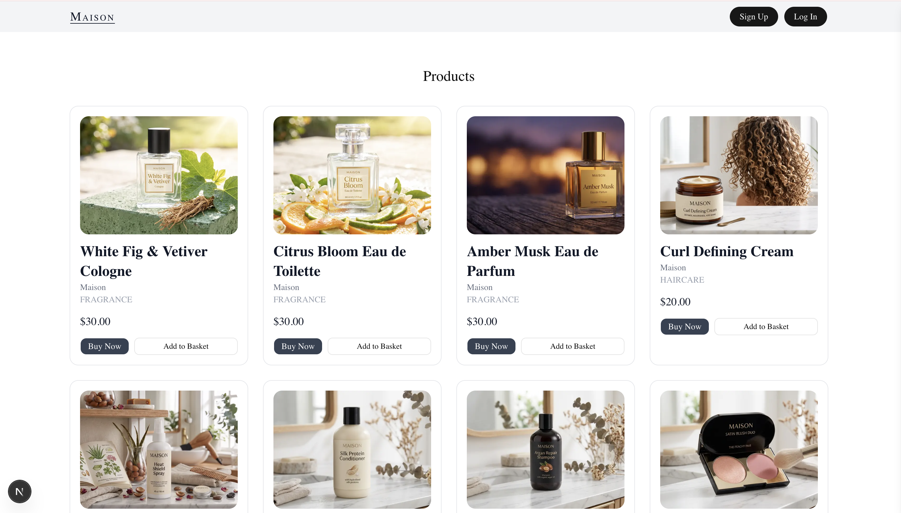
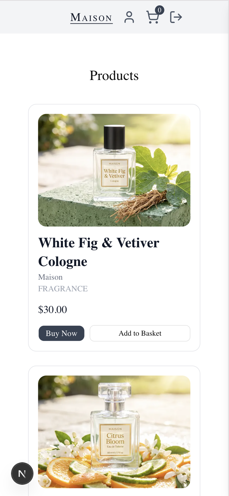
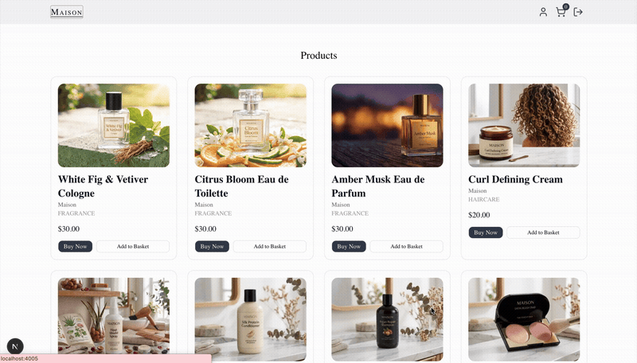
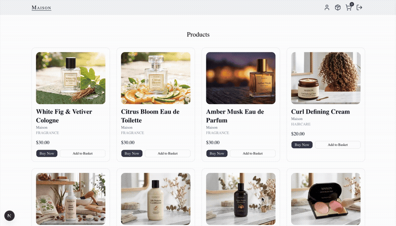

# Maison - Modern E-Commerce Platform

> A full-stack e-commerce application built with Next.js, React, TypeScript, MongoDB (Prisma), Auth0, and Stripe, following production best practices.


**[Live Demo](https://e-commerce-app-inky-mu.vercel.app/)**

### Desktop View



### Mobile View



---

## 🎯 Overview

**Maison** is a full-stack e-commerce platform demonstrating modern, type-safe web development — from product browsing and cart management to checkout and admin operations.

This project showcases proficiency in:

- 🏗️ **Modern Architecture** — Next.js App Router with Server Components and Server Actions
- 💳 **Payment Integration** — Stripe Checkout with webhook-driven order confirmation
- 🔐 **Authentication & Authorization** — Auth0 with role-based access control
- 🗄️ **Type-Safe Data Layer** — Prisma ORM against MongoDB
- 🧪 **Testing** — Jest/React Testing Library for units, Playwright for end-to-end flows
- ⚡ **Production Practices** — CI via GitHub Actions, branch protection, image storage via Vercel Blob

---

## ✨ Features

### 🛍️ Customer Experience

#### **Product Browsing**



- **Product Browsing** — Category-based browsing with a Prisma-backed Category enum
- **Responsive Grid** — Product cards adapt from a multi-column desktop grid to a single-column mobile layout

#### **Shopping Cart**


- **Shopping Cart** — Persistent Cart/CartItem model with upsert logic and quantity controls, backed by React Context (`CartDrawer`)
- **Stock Awareness** — Low-stock and out-of-stock badge logic surfaced at the product level
- **Live Totals** — Cart drawer recalculates line items and total in real time as quantities change

#### **Checkout & Payment**


- **Checkout** — Stripe Checkout integration with a dedicated `CheckoutButton`, mobile-aware add-to-basket handling
- **Order Confirmation** — Post-checkout `/success` page with expanded line items, plus styled HTML order confirmation emails
- **User Profiles** — Auth0-authenticated profile editing with split read-only/edit routes, validated via Zod

### 🎛️ Admin Dashboard



- **Product Management** — Full CRUD with Vercel Blob image uploads and an `isActive` soft-delete flow
- **Access Control** — Role-based access control via an Auth0 Post-Login Action, enforced across admin routes
- **Order & Webhook Handling** — Stripe webhook event handling to keep order state in sync

---

## 🛠️ Tech Stack

### **Frontend**

- **[Next.js 16.2.1](https://nextjs.org)** — React framework with App Router
- **[React 19.2.4](https://react.dev)** — UI library
- **[TypeScript 5](https://www.typescriptlang.org)** — Type-safe development
- **[Tailwind CSS 4](https://tailwindcss.com)** — Utility-first styling
- **[shadcn](https://ui.shadcn.com)** + **[Radix UI](https://www.radix-ui.com)** — Accessible component primitives
- **[React Hook Form 7.72](https://react-hook-form.com)** + **[Zod 4.3.6](https://zod.dev)** / **[Yup 1.7.1](https://github.com/jquense/yup)** — Form state and schema validation
- **[Lucide React](https://lucide.dev)** — Icon library

### **Backend & Data**

- **Next.js Server Actions** — Type-safe server-side mutations
- **[Prisma 6.6.0](https://www.prisma.io)** on **MongoDB** — Type-safe data access layer
- **[Auth0 (@auth0/nextjs-auth0) 4.18.0](https://auth0.com)** — Authentication and role-based access control
- **[Stripe 22.0.2](https://stripe.com)** — Checkout and webhook-driven payment processing
- **[Vercel Blob 2.3.3](https://vercel.com/docs/storage/vercel-blob)** — Product image storage and CDN

### **Development & Testing**

- **[ESLint 9](https://eslint.org)** — Code linting
- **[Jest 30.4.2](https://jestjs.io)** + **[React Testing Library](https://testing-library.com/react)** — Unit and component tests
- **[Playwright 1.61.1](https://playwright.dev)** — End-to-end tests, including a real Stripe checkout automation flow
- **[GitHub Actions](https://github.com/features/actions)** — CI pipeline with branch protection

---

## 🚀 Getting Started

### **Prerequisites**

- Node.js 18.x or higher
- npm
- A MongoDB database (e.g. [MongoDB Atlas](https://www.mongodb.com/atlas))
- An Auth0 tenant ([Sign up](https://auth0.com/signup))
- A Stripe account ([Sign up](https://dashboard.stripe.com/register))
- A Vercel account for Blob storage ([Sign up](https://vercel.com/signup))

### **Installation**

1. **Clone the repository**

   ```bash
   git clone <repository-url>
   cd e-commerce-app
   ```

2. **Install dependencies**

   ```bash
   npm install
   ```

   `postinstall` runs `prisma generate` automatically.

3. **Set up environment variables**

   Create a `.env.local` file in the root directory:

   ```env
   # Database
   DATABASE_URL="mongodb+srv://..."

   # Auth0
   AUTH0_SECRET=your_auth0_secret
   AUTH0_BASE_URL=http://localhost:4005
   AUTH0_ISSUER_BASE_URL=https://your-tenant.auth0.com
   AUTH0_CLIENT_ID=your_auth0_client_id
   AUTH0_CLIENT_SECRET=your_auth0_client_secret

   # Stripe
   STRIPE_SECRET_KEY=sk_test_...
   NEXT_PUBLIC_STRIPE_PUBLISHABLE_KEY=pk_test_...
   STRIPE_WEBHOOK_SECRET=whsec_...

   # Vercel Blob
   BLOB_READ_WRITE_TOKEN=vercel_blob_...

   # Application URL
   NEXT_PUBLIC_APP_URL=http://localhost:4005
   ```

4. **Set up the database**

   ```bash
   npx prisma generate
   npx prisma db push
   ```

5. **Set up Auth0**

   - Create a Regular Web Application
   - Add `http://localhost:4005/api/auth/callback` to Allowed Callback URLs
   - Configure a Post-Login Action for role assignment

6. **Set up Stripe**

   - Create products/prices as needed, or let admin actions create them
   - Point a webhook endpoint at your deployed app's Stripe webhook route
   - Add the relevant checkout/session webhook events

7. **Run the development server**

   ```bash
   npm run dev
   ```

8. **Open your browser**

   Navigate to <http://localhost:4005>

---

## 🧪 Testing

### **Unit Tests**

Run Jest unit tests (Jest + React Testing Library):

```bash
npm test

# Watch mode
npm run test:watch
```

Covers components such as `EditProductForm`, `NewProductForm`, `AddToBasket`, `CartDrawer`, `DeleteProductButton`, `QuantityControlButtons`, `ProductFormFields`, and the `authz.ts` authorization helpers.

### **End-to-End Tests**

Run Playwright E2E tests:

```bash
# Run all E2E tests
npm run test:e2e

# Run in UI mode for debugging
npm run test:e2e:ui
```

The suite includes folder-scoped authentication, full CRUD flows using `test.step()`, Prisma-seeded test data, and a real Stripe checkout automation flow.

**Testing principles:** prioritize critical and error-prone behavior over maximizing raw coverage, use `waitFor` for async handlers, and reuse a `createMockProduct`-style helper pattern across test files.

---

## 🏆 Technical Highlights

### **1. Type-Safe Architecture**

- End-to-end TypeScript across the codebase
- Zod/Yup validation schemas for form and server input
- Prisma-typed data access layer against MongoDB

### **2. Authentication & Authorization**

- Auth0-based sign-in with a Post-Login Action for role assignment
- Role-based access control enforced on admin routes

### **3. Payment Integration**

- Stripe Checkout session flow
- Webhook signature verification and event handling
- Order confirmation emails with inline-styled HTML

### **4. Code Quality & Testing**

- Component-level Jest/RTL tests alongside full-flow Playwright E2E tests
- Consistent mock/data-seeding helpers for maintainable tests

### **5. CI/CD**

- GitHub Actions CI pipeline
- Branch protection rules requiring checks to pass before merge

---

## 🎓 Key Learnings

Building Maison involved:

1. **Next.js App Router patterns** — Server Components vs. Client Components, Server Actions for type-safe mutations
2. **Cart and checkout state** — Prisma-backed Cart/CartItem models, React Context for client-side cart state, syncing with Stripe Checkout
3. **Debugging cross-cutting issues** — resolving interconnected Auth0, cart, and Stripe bugs (duplicate cart records, relation violations, environment/key mismatches)
4. **End-to-end testing discipline** — designing a Playwright suite around real user flows, including a live Stripe checkout automation
5. **Production readiness** — CI pipelines, branch protection, and soft-delete patterns for safer admin operations

---

## 📄 License

This project is for portfolio purposes.
